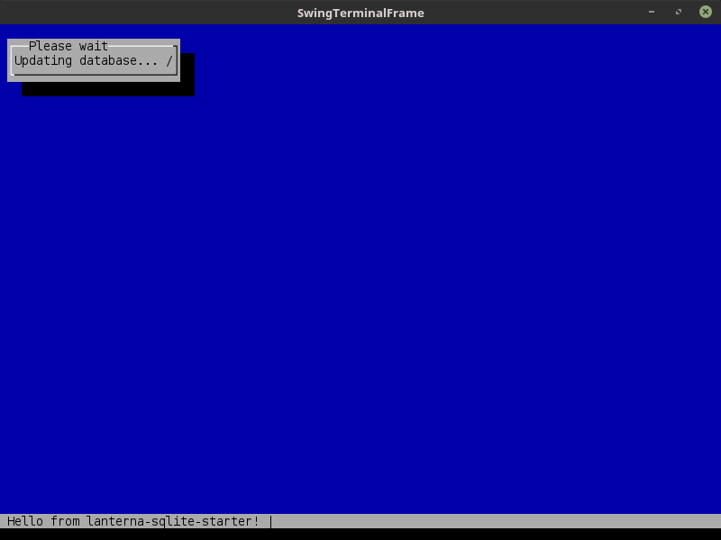
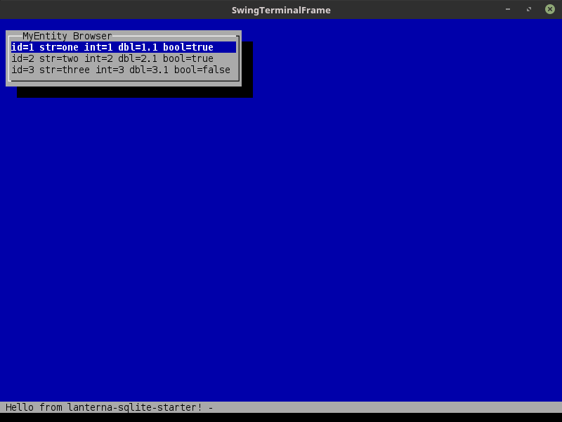

# lanterna-sqlite-starter

An example app which can be used as a foundation for Kotlin-based terminal applications using [Lanterna](https://github.com/mabe02/lanterna) and SQLite3 database with simple [Norm](https://github.com/dieselpoint/norm) ORM.

This app by default creates empty database with schema and then populates some test data in [`Db`](src/main/kotlin/com/lifeinide/lanterna/db/Db.kt):



Then it displays the data in the `ActionListBox`:



## Features

1. Default UI with status bar and background panel (see [`App`](src/main/kotlin/com/lifeinide/lanterna/App.kt)).
1. Database singleton for all database operations with support for transparent transactions management, database schema creation and population and database update (see [`Db`](src/main/kotlin/com/lifeinide/lanterna/db/Db.kt)).
1. **Norm**-based entity model (see [`MyEntity`](src/main/kotlin/com/lifeinide/lanterna/db/model/MyEntity.kt)).
1. Separate service layer to operate on entities (see [`MyEntityService`](src/main/kotlin/com/lifeinide/lanterna/db/service/MyEntityService.kt)).
1. Background executor service with throbber support (see [`ExecutorService`](src/main/kotlin/com/lifeinide/lanterna/service/ExecutorService.kt)) with optional wait dialog (see [`UIHelper`](src/main/kotlin/com/lifeinide/lanterna/ui/UIHelper.kt)).

## Build and start

To build and start the app use:

```bash
$ gradle clean shadowJar
$ java -jar build/libs/lanterna-sqlite-starter-1.0-SNAPSHOT-all.jar 
```
